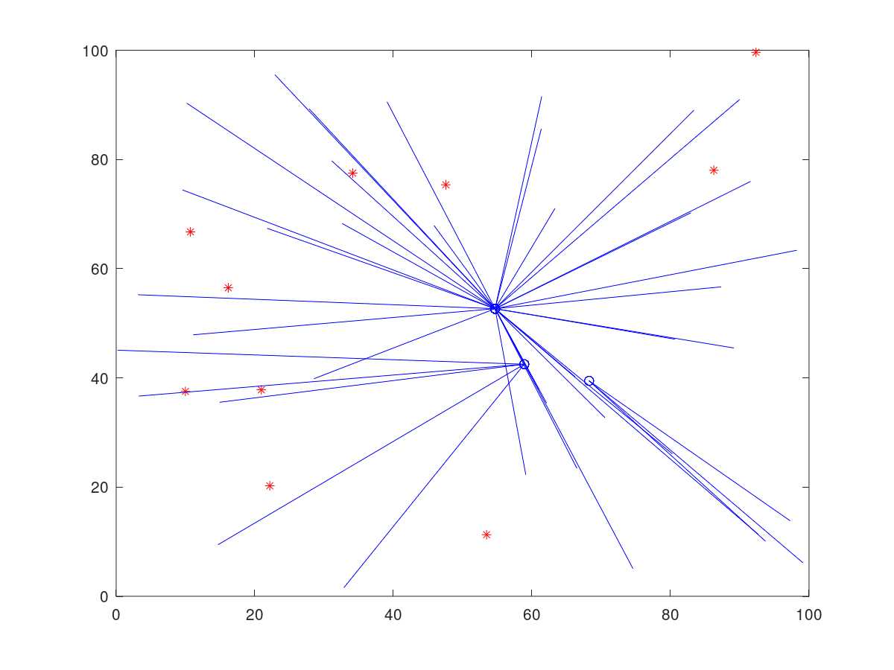
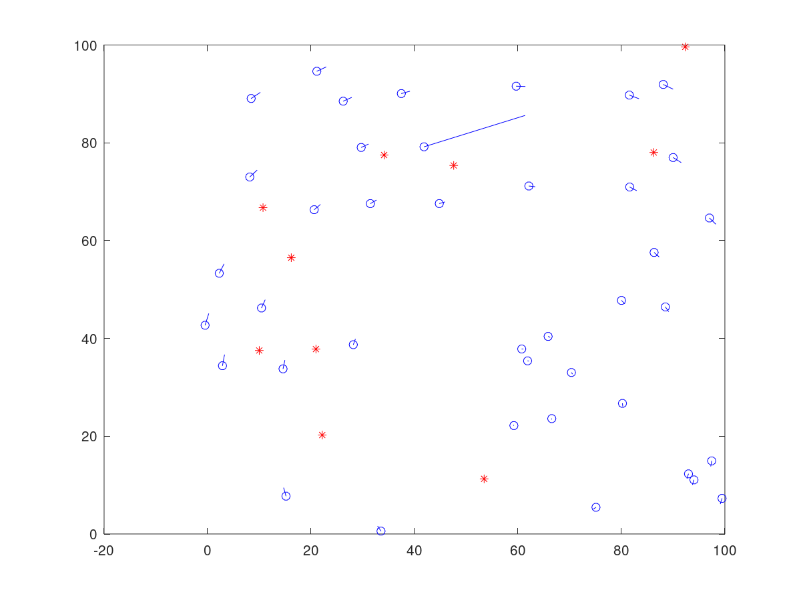

<div>
    
</div>
<br>
<br>
<br>

<div align="justify"> 
    <b>Hybird Differential Evolution </b> (HyDe). A hybrid optimization framework 
    that combines the exploration capabilities of Differential Evolution and the exploitation 
    capabilities of iterative local search (GD,L-BFGS). Solves the Sensor Network Localization Problem (SNLP) in 2,3 dimensions.
</div>


### Requirements:

| Package                                            | Version (>=) |
|----------------------------------------------------|--------------|
| [Python](https://github.com/conda-forge/miniforge) | 3.8.1        |
| [NumPy](https://numpy.org)                         | 1.24.1       |
| [oct2py](https://pypi.org/project/oct2py/)         | 5.5.1        |
| [pandas](https://pandas.pydata.org)                | 1.3.4        |
| [json5](https://pypi.org/project/json5/)           | 0.9.5        |
| [matplotlib](https://pypi.org/project/matplotlib/) | 3.4.0        |
| [regex](https://pypi.org/project/regex/)           | 2019.8.19    |

Additionally, a CUDA enabled GPU supporting at least ```sm_arch=60``` and the CUDA compiler (`nvcc >= 11.4`) from the [cuda toolkit](https://docs.nvidia.com/cuda/cuda-installation-guide-linux/index.html) is required.
                         
## Solve a random SNLP problem with:
```shell
make test
```

## Sensor Network Localization Comparison
The red stars are the anchor locations, the blue circles represent the estimated sensor positions and the lines represent the distance between the true and estimated positions.

<div style="display: flex;">
    <div style="flex-basis: 50%;">
        <h3>DVHop</h3>
        
    </div>
    <div style="flex-basis: 50%;">
        <h3>HyDe</h3>
        
    </div>
</div>


## References

1. [Niculescu, D., Nath, B. DV Based Positioning in Ad Hoc Networks. Telecommunication Systems 22, 267–280 (2003). https://doi.org/10.1023/A:1023403323460](https://link.springer.com/article/10.1023/a:1023403323460)
1. [WSN-localization, zenzondon](https://github.com/zenzondon/WSN-localization)